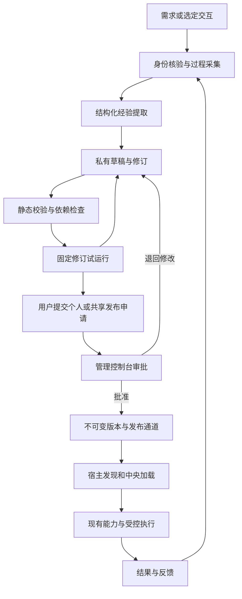

# 业务技能创作与交互沉淀发布设计

## 本次实现调整（2026-10-02）

本次采用以下可运行方案，后文的持久后台生成作业和独立评测属于后续增强，不将它们标记为已实现：

- 所有认证用户可保存私有草稿；从需求或当前可见交互由已有模型生成真实方法后调用创作工具保存。中央仅存脱敏过程摘要和可核对的本人任务状态，不集中复制完整聊天。宿主提供的完整性声明不当作独立证据。
- 自动模式改为当前对话回合内沉淀。用户开关默认关闭；开启后模型在有可复用成果或用户纠正时提炼并保存，不另开后台模型回合。保存时在同一事务中复核开关，按输入去重，每位用户每日最多三次自动保存；关闭立即阻止后续自动保存。宿主离线或回合中断不会凭空生成，用户可在后续回合手动继续。暂不承诺离线自动恢复和全历史分析。
- 试运行采用固定修订的合成样例。OpenClaw 在该回合拦截其他 AgentBridge 工具；结果只标记“已报告，待人工复核”。申请冻结方法、模式、范围和样例记录。管理员必须勾选复核并填写意见才能批准，不把模型自测当作独立通过。
- 因发布只有中央 SQLite 变更，审批通过、不可变版本插入、受众分配和审计在一个事务内完成。失败保持待审批，可重试；无需单独的异步发布工作进程。
- 个人与指定账号共享使用同一审批路径；配置和加载均不得扩大已审批范围，业务权限独立校验。更新只切换新任务版本，已有任务保留旧快照。恢复历史修订会创建新草稿修订，必须重新试运行和审批；归档草稿也可恢复。
- Workspace 提供编辑、历史恢复、试用、提交、撤回、归档及 JSON 导入导出；控制台提供固定申请详情、通过发布、退回与拒绝。导出仅包含方法包，不包含来源摘要、身份、样例或审批历史。最多100份活动草稿、每份500个修订、每修订50次样例。

新增 `skill_authoring.py` 作为共享服务，Workspace 和 MCP 均从认证会话取得作者身份；MCP 明确只开放创作动作，没有审批动作。旧五个内置助手继续使用原 ID 与内容哈希。数据库仅新增表和索引，不改动业务授权或旧账本。

日期：2026-10-01。更新日期：2026-10-02。状态：待实施设计。本文件定义 AgentBridge 的 Skill 创作、交互沉淀、试运行与独立发布闭环，不表示下述接口、数据表或界面已经实现。

本轮目标是让普通用户把自然语言需求和已经完成的工作过程沉淀为自己的业务助手，并在校验与试运行后提交发布，由管理控制台审批后生效。系统应尽量从交互过程提炼方法、参数和用户修正，只询问影响方法正确性的缺失信息。个人和共享发布均须审批，业务执行继续使用现有中央能力、持久计划和可信交互。

## 一 已确认的产品决定

1. 所有已登录且账号有效的用户默认可以生成和编辑自己的私有草稿，不要求管理员逐份创建。
2. 同时支持根据需求生成、根据选定交互过程生成、基于已有助手创建修订草稿。优先自动提取已有信息。
3. 用户说“把刚才这个过程做成助手”即授权生成本次范围的私有草稿；普通业务请求本身不等于授权持久保存草稿。
4. 提供完成后建议，以及用户主动开启的自动沉淀。自动沉淀只创建私有草稿或修订候选，不自动发布、共享、分配或试跑业务写入。
5. 普通用户可以发起个人或共享发布申请；管理控制台中有相应审批权限的管理员审核通过后，由系统发布。首次发布、内容更新和扩大使用范围均须审批，个人使用也不能直接免审生效。
6. 创建、测试、提交发布、审批、分配和使用权限分开。Skill 不授予业务权限，发布审批不扩大数据源范围，也不替代正式写入授权。
7. 只涉及规则与资源的 Skill 发布逐步与中央程序发版解耦；新增能力、转换、协议或执行机制仍走代码发布。
8. 现有五个内置助手继续可用，版本快照、任务绑定、来源合同、撤销和单次提交机制继续生效。

## 二 当前基础与新增范围

| 环节 | 当前仓库事实 | 本设计新增 |
| --- | --- | --- |
| 内容 | 五份包内 manifest、主说明和部分证据参考文件 | 用户草稿、修订历史、生成来源和结构化编辑 |
| 注册 | `SkillRegistry` 从程序包加载，校验路径、大小、模式和依赖 | 统一校验器和数据库内容仓库，保留包内适配器 |
| 版本 | `SkillStore` 保存内容哈希、不可变版本及绑定快照 | 发布收据、版本通道、个人版本选择和回退 |
| 配置 | 用户分配、允许模式、默认值、启停与审计 | 创作与发布申请权限、控制台审批权限、自动沉淀偏好 |
| 使用 | 宿主获取简介并按目标加载，中央绑定任务与版本 | 显式草稿试运行与发布版本发现 |
| 可观测性 | Skill 加载事件、任务与运行追踪 | 生成来源、试运行报告、发布到结果的关联 |
| 过程材料 | 中央有任务、操作、计划等事实；Workspace 聊天历史从 Gateway 获取 | 按身份和任务范围采集交互的宿主合同及完整性声明 |

当前注册器限制主说明和参考文件共不超过 16 个、资源正文总计不超过 48,000 字符；发布内容不支持任意脚本。本期沿用这些内容约束，新增附件类型须单独扩展合同。当前有固定数据库分析评测框架，但已有记录明确未完成真实模型盲测，不能把它作为新增草稿的已验证质量证明。

实现依据：[中央 Skill 实现](../../bscli/core/business_skills.py)、[宿主选择和绑定](../../integrations/openclaw-agentbridge/lib/business-skills.js)、[工作台应用](../../bscli/workspace/application.py)、[任务存储](../../bscli/core/tasks.py)、[运行追踪](../../bscli/core/runtime_governance.py)。既有边界见[一期设计](./业务技能接入与能力提取一期设计.md)、[九月二十八日补充验收](../验收记录/业务助手补充与发布恢复验收-2026-09-28.md)和[固定质量评测](../测试与验收/数据库内容分析固定评测.md)。

## 三 用户流程

### 从需求创建

用户在“我的业务助手”选择新建，或直接说“帮我做一个部门工作复核助手”。系统读取当前用户可见的能力目录与已有助手，生成适用范围、输入、步骤、输出和模式，列出能力缺口。需求不完整仍可保存草稿，只有阻碍发布或执行的问题才需要补齐。

### 从交互创建

用户在任务结果中选择“保存为助手”，或说“把刚才的过程做成助手”。系统解析本次任务及必要的相邻纠正记录；目标明确时直接生成，多个独立任务无法消歧时让用户选择范围。默认不扫描整个账号的历史聊天。

生成结果展示“已提炼的方法、已参数化的内容、已验证到哪一步、尚缺什么”。用户可用自然语言修改，例如“以后先给我简版”“把日期改成每次询问”。修改生成新修订，保留原内容和差异。

### 完成后建议与自动沉淀

完成后建议和自动保存分别设置，均可关闭。建议默认开启，仅在符合复用条件且过程材料足够时提示；用户拒绝后对相同候选冷却。自动沉淀默认关闭，开启时明确采集范围、私有草稿用途和资源预算。

自动模式处理开启后的选定项目或会话范围，不追溯所有历史。识别到候选后自动生成私有草稿；缺信息标记待完善，不为每个候选打断用户。默认汇总到草稿列表，只在出现需要处理的问题时提示。用户可排除某次任务、暂停或关闭自动沉淀。

普通任务的失败、取消与结果未知不会被标为成功经验。主动要求时可以提炼已验证的前半段；可信卡等待核对可作为“准备表单”模式的完成点，但不能证明提交与回读已验证。生成和测试任务自身不触发再次自动沉淀，避免递归生成。

### 发布使用

用户查看校验和试运行结果，选择个人或共享范围并提交发布申请。管理控制台展示待审批列表，审批人查看固定修订、内容差异、依赖、验证报告和申请受众，批准、退回修改或拒绝。批准后系统自动执行发布；申请人可查看进度、审批意见和最终发布结果，无需再次提交同一版本。

审批期间保持当前已发布版本可用，待审内容不进入正常加载目录。发布成功后可明确选择助手，也可允许自然语言自动匹配。审批人只查看申请所含的已清理内容及必要报告；审批权限不默认提供用户全部聊天记录。

## 四 权限与内容归属

下表为拟新增产品权限，不等同于当前业务权限目录中的能力。创作权限作为平台权限单独建模，认证主体仍来自服务端，不能由模型参数指定。

| 行为 | 草稿所有者 | 获授权协作者 | 具有相应审批或管理权限的管理员 |
| --- | --- | --- | --- |
| 创建私有草稿 | 默认允许 | 以自己身份创建 | 以自己身份创建 |
| 读取和编辑草稿 | 允许 | 按该草稿的读取或编辑授权 | 无自动内容访问权，须有相应授权或审核申请 |
| 试运行 | 在本人业务权限内 | 经草稿授权，在协作者本人的业务权限内 | 同样不能借用作者权限 |
| 提交个人或共享发布申请 | 允许通过门槛的本人草稿 | 按所有者授予的提交权限，编辑权不自动包含提交权 | 可查看其审批范围内的固定申请内容 |
| 审批发布申请 | 普通用户不允许 | 普通用户不允许 | 在管理控制台批准、退回修改或拒绝 |
| 正式发布生效 | 不能直接切换正式版本 | 不能直接切换正式版本 | 批准后由系统按批准范围发布 |
| 共享分配 | 不能通过提交申请自行分配给他人 | 另需管理授权 | 在批准的受众和模式范围内分配 |
| 暂停、下架 | 自己的个人版本 | 另需授权 | 可按管理范围停用并记录原因 |

有效操作范围是账号状态、平台操作权限、资源授权与当前业务权限的交集。创建无依赖的草稿无需先拥有所有业务权限；依赖不足时可以保存和静态校验，但不能借管理员或服务账号试运行。发布门槛未满足则保持草稿。

首次实现共享时，接收者采用中央用户列表，与现有用户分配复用；没有现成的可信团队身份映射时，不从数据库部门或显示名称推断成员关系。细粒度团队组和多人同时编辑在后续阶段增加。

同名助手可以存在，但具有不同的不可变 `skill_key`；界面显示所有者与来源。新建个人副本保留 `derived_from`，不覆盖内置或共享原版。用户请求“改进这个助手”时，无原版编辑权则生成个人副本或修订建议。

## 五 总体架构

新增创作服务负责草稿、采集作业、生成、校验、试运行记录和发布；内容仓库统一管理包内与用户发布内容。宿主负责采集其实际拥有的交互以及模型生成，中央负责身份、材料引用核验、内容持久化、版本选择和执行约束。

第一阶段复用当前已认证宿主执行生成任务，不在中央另建一套模型账号和模型调用链。生成作业必须具有独立类型、输入范围、输出结构、超时和状态回执。宿主离线时可保存待生成需求，界面显示等待或失败，不伪称草稿已生成。自动沉淀通过持久队列调度同类作业。

生成作业使用独立的内部运行上下文，关联发起会话但不复用其活动业务绑定，也不把后台生成消息插入用户正在执行的任务。输出采用版本化的结构化候选合同，由中央验证后保存；格式错误允许在同一预算内修复一次，仍失败则保存失败报告，不把部分输出发布为 Skill。

Skill 生成器是平台创作工作流，只能读取获准过程与目录、提交候选内容，不因用户草稿中的文字执行新业务。它不接受来自业务正文的发布、授权或配置变更指令。

## 六 过程采集与自动提炼

### 材料来源与可信程度

| 材料 | 用途 | 能证明的范围 |
| --- | --- | --- |
| 用户原始请求和后续纠正 | 目标、参数、输出偏好和边界 | 用户在该上下文中的明确表达 |
| 宿主消息和工具轨迹 | 发现尝试路径、参数调整和回答 | 宿主记录的过程，不自动等于中央成功事实 |
| 中央任务、操作、计划及回读 | 确认能力、版本、状态和结果 | 实际执行到的步骤及核验结果 |
| 用户结果反馈 | 补充使用体验、纠错和偏好 | 用户反馈，不代替权威业务回读 |

中央不能从当前 `chat_history` 的有限条数和字符预算推断交互完整。新增采集合同返回 `conversation_ref`、`run_refs`、消息边界、材料摘要哈希、缺失或截断说明及采集时间。宿主引用必须与认证身份、端点和中央运行记录对应。不能核实的模型总结标为声明材料，不能据此生成“已验证”标签。

采集只读当前用户可访问的消息与任务；跨用户内容不因出现在同一会话名称下就可读取。跨宿主获取不到聊天时可使用中央任务轨迹生成不完整草稿，明确缺少用户纠正等信息。一次采集失败不得重新执行原业务来补记录。

### 生成步骤

1. 固定用户选择的任务范围、材料引用、生成策略版本和作业幂等键。
2. 区分任务目标、成功步骤、失败尝试、用户纠正与最终验证；多个独立目标分别提出候选。
3. 将本次日期、工时、人员、项目、事项编号、数据源标识等提取为参数或待选择项；只有用户明确要求的个人默认值才保存在独立配置中。
4. 对照当前可见能力、参数 Schema、来源和转换目录，生成可执行的方法；未知能力列为缺口，不编造工具。
5. 生成 `selection`、模式、输入、输出、完成标准、异常路径、依赖和参考内容，并标注各模式的验证范围。
6. 与本人可访问的既有 Skill 比较目标、依赖和方法；结果为新建、个人配置建议或修订候选。仅名称相似不能自动合并。
7. 执行结构校验、依赖检查、敏感材料检查和规则冲突检查；保存草稿及报告。
8. 展示需要用户判断的差异和缺口；可确定的信息不重复询问。

生成的主说明描述复用方法，来源关联单独保存。可发布内容不包含原始聊天、真实业务正文、凭据、卡片 URL、内部操作 ID 或无需固定的个人身份。共享前重新检查内容与样例。检测器和模型检查都不能保证清理完全，共享审核须能看到最终发布的确切内容；素材不会随 Skill 包一起导出。

### 去重与并发

同一任务产生多个完成事件时，用 `owner + source_run + generation_kind + policy_revision` 去重作业；再次收到事件返回原作业。用户明确重新生成可创建新作业并保留父子关系。内容相似性只产生合并建议，不进行跨用户搜索，也不擅自改写现有共享版本。

生成开始时固定目标草稿的 `expected_revision`。期间有人编辑，生成结果保存为待合并候选并展示差异，不覆盖手工修改。发布版本不作为生成作业的写目标。

自动偏好变更和任务完成事件通过持久记录关联；消费前再次检查账号、范围和偏好版本。关闭后取消未开始的作业，已运行作业终止或停止保存；与关闭竞争的落库在同一检查事务内决定先后，关闭前已保存草稿仍由用户管理。

## 七 草稿结构与校验

草稿使用结构化元数据加 Markdown 方法正文。简单表单负责名称、范围、输入、模式和依赖，正文与参考文件可编辑；自然语言修改生成新的修订，不另存一套可能不一致的正文。

| 字段 | 内容 |
| --- | --- |
| `skill_key / owner_subject / origin` | 稳定身份、所有者及内置或用户创作来源 |
| `draft_revision / content_hash` | 单调修订号和规范化内容摘要 |
| `name / description / selection` | 简介、适用与排除目标、交付物 |
| `profiles / required_resources` | 模式依赖和确定性加载清单 |
| `input_contract` | 参数类型、必需性、允许默认值和数据来源 |
| `output_contract` | 各模式的产物、完成条件和证据要求 |
| `execution_contract` | 只读探索、持久计划或受控操作及必要约束 |
| `compatibility` | Skill 协议、宿主特性及能力和转换合同版本 |
| `resources` | 主说明与白名单参考文件，内容预算沿用现有规则 |
| `derivation / evidence_refs` | 来源、提炼依据与已验证范围，独立私有存储 |

校验分三层：结构和引用可由程序确定；能力与版本兼容由中央目录确定；方法是否合理、描述是否重叠由模型检查和试运行辅助判断。不能把模型审核描述成静态安全证明。

现有 `preview` 只读约束、`single` 通过名称中 `batch` 判断的规则逐步转为显式模式合同。业务执行限制必须由中央执行路径强制落实，不能只在正文中写“不可提交”。权限、来源、受控写入等中央约束不允许用户草稿覆盖。

平台规则、共用证据规则和具体业务方法分别维护。复用规则在发布时按版本展开进入不可变快照，旧任务不随共享文件变化。必读材料继续一次返回，避免重新引入模型漏读；大型可选示例后续才按需加载。

## 八 状态与试运行

状态分开保存，避免用一个 `trial` 同时表示草稿、测试和可用性。

| 对象 | 状态及转换 |
| --- | --- |
| 生成作业 | `queued → running → succeeded / needs_input / failed / canceled` |
| 草稿 | `editing / ready / archived`；ready 是对具体修订的校验结论，内容改变后重算 |
| 试运行 | `queued → running → waiting_user → succeeded / failed / canceled / unknown`；允许直接从 running 结束 |
| 发布申请 | `submitted → approved / changes_requested / rejected / withdrawn`；个人和共享均适用，批准固定内容哈希、受众与模式 |
| 发布执行 | `pending → publishing → published / failed`；批准后自动推进，已批准不等于已发布 |
| 已发布版本 | 内容不可变，带发布收据；可标记下架，不覆盖或原地编辑 |
| 使用通道 | 当前版本指针与 `enabled / trial / disabled`，以及接收者和允许模式 |

试运行固定草稿修订、哈希、输入、模型与宿主版本及执行策略。草稿不进入正常自动选择目录；只有显式测试加载能生成 `kind=draft_test` 的绑定，限本次用户、任务和快照。测试期间修改草稿不会改变正在运行的内容，也不会让旧测试报告验证新修订。

提供三种测试层次：

- 静态预检：不调用业务，检查结构、依赖、模式和引用。
- 隔离样例：使用合成或已获准的脱敏材料验证选择和产物，不连接真实写终点。
- 真实只读或准备：用户明确发起，在本人权限内读取或生成可信核对卡；正式提交单独经过既有授权链。自动测试默认不能提交业务。

每个模式单独记录测试范围和结论。首次个人发布申请要求结构与兼容检查通过，并有该修订至少一个代表性测试通过；缺少真实条件时可用隔离样例，但版本显示“样例验证”，不能显示“实际业务验证”。测试通过仅满足申请门槛，仍须控制台审批。未覆盖模式不作为已验证模式启用。受控写模式须另有授权边界、取消、结果未知和来源完整性的合同测试；没有真实提交样本时明确其验证边界。

共享发布增加模式边界、负例、跨用户隔离及代表性业务输出复核。固定样例不得只有生成源过程，至少包含不同参数或邻近目标，防止仅记住一次成功。

试运行报告绑定内容哈希、能力合同指纹与评测版本。内容、能力合同或模式范围改变时，受影响结论失效；权限和数据源可用性即使报告仍有效，也须在发布、加载与调用时重新检查。

## 九 独立发布与回退

发布申请包含固定草稿修订、内容哈希、目标通道、使用范围、允许模式、预期通道修订、变更说明和幂等键。服务端校验提交权限、报告和兼容性后进入待审批状态，不切换正式版本。只有管理控制台的审批接口可以写入批准决定；普通用户、宿主和模型不能通过发布接口或传入“已审核”字段绕过审批。

审批记录保存申请修订、内容哈希、受众、模式、审批人、时间和意见。批准后持久提交发布作业，系统自动发布同一快照；退回修改和拒绝须提供原因。申请人可撤回尚未发布的申请；撤回与发布竞争时由事务检查确定先后，不能用撤回撤销已经生效的版本。审批决定写入与发布作业入队保持事务一致，避免批准后任务丢失。

发布事务一次完成：写入不可变版本、保存报告和审批引用、切换目标通道指针、更新配置修订与审计、写入目录变更事件。事务前先完成有耗时的检查，事务中复核批准状态、审批权限仍有效、内容哈希、受众、模式和通道修订。审批失效、申请已撤回或范围不符时停止；内容入库失败不切指针；相同版本不同内容拒绝。发布失败保留审批及失败原因，条件仍满足时按原申请幂等续接，不能标成已发布；响应丢失先查询收据。

版本号由服务端分配或验证为严格递增的三段版本，语义变更说明由作者填写；所有内容与资源参与哈希。审批固定申请内容，用户可以继续编辑工作草稿，但不能替换待审快照；要发布新修订须另行提交，原批准不得复用。扩大受众或启用未批准模式也须重新申请。用户明确请求发布且参数齐全时直接创建申请，不重复询问是否申请，回复明确“已提交，等待审批”；自动沉淀偏好不构成发布申请授权。

个人版本审批发布成功后首次仅为本人建立分配，允许明确调用；是否启用自动匹配是个人配置。共享发布生成可分配版本，不自动面向所有人启用。试用用户固定已获批准的候选版本，稳定用户继续旧版本；推广只能在批准受众内进行，扩大范围须经控制台审批。

新任务按服务端解析到的版本加载，旧任务继续绑定快照。回退切换新任务使用的版本，不删除新版本历史、不改已开始任务、不回退业务数据。需要停止有问题的在途任务时，单独执行停用或撤销，并保留已经提交后的必要对账路径。

普通用户可申请回退；管理员在控制台执行回退，校验目标版本仍获准用于当前受众和模式，并保存决定与回执。用户可以暂停自己的助手使用，但不能借版本切换、导入、复制或回退把未批准内容放入正式目录。

协议升级后目录仍先返回简短摘要。每次加载和业务调用继续检查实时权限与禁用状态，缓存不能复活已停用版本。通道变更无需重启兼容宿主；宿主以配置修订刷新发现结果，不能把旧对话中的加载视为当前绑定。

## 十 存储与接口合同

以下是拟新增的逻辑对象和接口族，实施时需注册、鉴权与测试，不能作为当前可调用接口。

### 存储对象

| 对象 | 关键内容与约束 |
| --- | --- |
| `skill_definitions` | 稳定 skill_key、所有者、来源、派生关系、生命周期 |
| `skill_drafts / skill_draft_revisions` | 草稿当前修订、不可变修订内容和编辑事件；使用乐观锁 |
| `skill_source_captures` | 私有过程引用、清理后最小材料、完整性和可信等级 |
| `skill_generation_jobs` | 用户、来源范围、策略版本、状态、租约、重试和幂等键 |
| `skill_validation_runs / skill_test_runs` | 固定修订、合同指纹、测试模式、结果与报告 |
| `skill_review_requests` | 个人及共享发布申请、固定修订和哈希、受众与模式、审批意见、决定及撤回状态 |
| `skill_release_channels / skill_release_receipts` | 当前版本、受众、修订、发布与回退回执 |
| `skill_collaborators / skill_authoring_preferences` | 草稿协作授权、自动沉淀范围与预算 |

继续复用现有 `skill_versions`、`skill_bindings`、`skill_task_bindings`、配置和事件机制；扩展字段时保留旧快照读法。新 Skill 可采用 `usr-<随机标识>` 的内部 ID，满足旧格式约束；显示名称不作为存储主键，避免为命名空间破坏所有旧绑定。

第一阶段复用中央 SQLite 与备份体系，把跨版本、通道、配置的发布变更放在同一事务。模型生成和业务试运行在事务外进行。新表必须进入备份、恢复和用户数据生命周期检查，不能只备份发布正文而遗失版本指针或草稿来源授权。

### 服务与宿主入口

| 接口族 | 主要操作 | 强制合同 |
| --- | --- | --- |
| 草稿 | 创建、读取、列出、修订、归档 | owner/ACL、游标分页、expected_revision |
| 来源采集 | 创建采集、读取范围、补充材料 | 当前身份、任务归属、消息边界、材料完整性 |
| 生成作业 | 从需求或过程生成、查询、取消 | 幂等键、输入快照、预算、身份与策略复核 |
| 校验和测试 | 校验、发起测试、读取报告、取消 | 固定修订与哈希、模式、真实业务授权 |
| 发布申请 | 提交、查询、撤回、修订后重新提交、申请回退 | 申请权限、固定哈希、受众与模式、幂等键 |
| 控制台审批与发布 | 批准、退回修改、拒绝、发布续接、回退、停用 | 管理审批权限、申请修订、批准范围、通道修订、发布回执 |
| 内容流转 | 导入、导出、创建副本 | 来源与依赖检查、私有素材排除、内容预算 |
| 自动偏好 | 读取、更新范围和预算 | 用户本人或有范围授权的管理员，变更审计 |

Workspace 使用 `/api/skill-drafts`、`/api/skill-generation-jobs`、`/api/skill-releases` 等新增路由，原 `/api/skills` 继续表示可用助手；对浏览器修改请求复用现有会话、Origin 和 CSRF 机制。

Workspace 的发布入口用于提交和查询申请；管理控制台提供独立审批路由，使用管理端认证与审批权限检查。发布工作进程只消费中央保存的有效批准记录，不接受普通用户直接提供批准标识来切换版本。

MCP 按上述服务合同暴露最小创作工具，不提供任意路径读取、任意表写入或任意宿主会话访问。生成器只获得读取素材和提交草稿所需工具；发布与权限变更不混入素材处理工具。普通业务目录不会因为支持创作就暴露所有管理员能力。

历史采集通过新增宿主特性协商，例如 `skillAuthoring` 和 `interactionCapture`。兼容宿主继续使用现有加载接口；不支持创作的宿主明确提示可在 Workspace 创建。需要新版合同的发布版本不得发送给旧宿主静默降级执行。

## 十一 异常恢复与资源管理

生成、测试和发布都有可查询的持久状态。生成作业使用租约和有限重试，超时标记失败或等待用户；收到迟到结果时校验作业代次，已取消或被替代的结果不能覆盖草稿。模型调用无法保证恰好一次，记录可能的重复尝试与费用，但最终保存通过幂等键保证去重。

建议首期采用可配置起始预算：每用户同时一个生成作业，每次最多选择五个相关任务；自动生成每天最多三个新候选，相同候选建议冷却七天。它们是待压测调整的产品默认值，不是当前实现限制。达到预算时保留需求并解释状态，不静默截断素材后宣称完整。

来源材料遵循最小保留：默认保存引用与清理后的提炼依据，采集临时原文在生成结束后清理；原始系统记录继续遵循其既有保留策略。草稿、报告和版本独立标注保留与删除规则。用户移除来源授权后停止新采集，相关共享申请需重新检查；已参数化的方法不自动等同于必须删除的原始材料。

删除草稿不影响已发布版本；删除定义首先禁止新加载。已绑定的版本按任务与审计保留策略处理，不能硬删除导致在途任务失去快照。材料到期后显示证据不可再访问，不把历史成功标签扩大成可重新验证。

导入只接收声明式 manifest、Markdown 与允许参考文件，解包检查路径穿越、符号链接、文件数量和压缩后展开大小。包含脚本、外部自动抓取依赖或未知能力的包不能自动启用；作为带缺口草稿处理或拒绝不支持的文件。导出不包含聊天素材、授权信息、用户分配和任务记录。

## 十二 界面与实例

“我的业务助手”增加“可使用”“我的草稿”“版本与试用”入口。普通用户主要看到目标、输入、步骤、产物、验证范围和缺口；内部协议、哈希和工具名称放在详情中。

草稿页支持自然语言修改、结构化编辑、修订差异、校验、试运行和“提交发布”。个人及共享申请均展示待审批、退回修改、已拒绝、已批准待发布、发布失败和已发布状态，以及审批意见。已发布详情展示版本、来源、适用模式、验证范围和更新记录。管理控制台统一展示发布申请、确切内容差异、依赖变化、测试结果与使用范围，提供批准并发布、退回修改和拒绝操作；缺少审核材料时不能仅凭生成器评分批准。

示例：用户先说“把昨天 OA 已办和已发整理成日志”，随后纠正“填成一小时日志，先让我核对”，最后成功收到填写卡但没有提交。用户要求保存过程后，系统应：

1. 识别与现有 `oa-work-log` 重叠，优先提出个人配置或派生草稿，不复制一份同名共享助手。
2. 提取日期和工时参数；“一小时”先作为本次输入，只有用户要求以后固定才设个人默认。
3. 保留基于来源的持久计划、合并与转换，填单模式输出可信卡。
4. 记录“填写准备经过实际验证，提交与回读未在该过程验证”。
5. 排除真实 OA 正文、事项编号与临时卡片链接，生成不同日期的隔离测试样例。
6. 经过校验和测试后由用户提交个人发布申请，管理控制台审批通过后系统发布；以后执行仍重新查询来源并授权。

## 十三 迁移与实施阶段

先把当前包内注册校验拆成可复用验证器与内容仓库接口，不一次性替换既有执行器。内置五个 Skill 的 ID、内容哈希、历史绑定与撤销语义保持兼容；包内版本可作为内置提供者保留，用户版本由数据库提供者管理。

需要同时改造目录枚举、依赖求值、`bind` 的版本选择和 `_allowed` 的状态检查，不能只向 `skill_versions` 插入记录而仍从包内 registry 读取当前内容。正常绑定先解析用户通道到不可变版本，再在同一一致性边界内复核配置；旧绑定继续按已存快照读取。草稿测试绑定走独立入口，不能伪装成正式分配或绕开撤销检查。

| 阶段 | 交付 | 完成门槛 |
| --- | --- | --- |
| 第一阶段 创作与审批发布 | 所有用户私有草稿、根据需求生成、编辑校验、固定修订测试、个人发布申请、管理控制台审批、独立发布和回退 | 双用户隔离、并发编辑、审批不可绕过、批准快照与发布一致、发布幂等、旧绑定与五个助手回归通过 |
| 第二阶段 从过程生成 | 过程采集合同、任务内提炼、来源分级、参数化、相似助手识别与修订建议 | 从真实受控任务提炼，过程截断和宿主离线如实呈现，材料不泄漏，用户纠正被保留 |
| 第三阶段 自动沉淀 | 完成后建议、用户主动开启自动保存、持久作业、预算、冷却和停止 | 重复事件不重复生成，关闭竞争处理正确，不自动发布或循环生成，后台任务可恢复 |
| 第四阶段 共享与持续维护 | 在既有审批流程上增加共享范围审核、指定用户试用、推广、导入导出、反馈与版本指标 | 固定哈希和受众审批、分配不授权、跨用户测试、发布回退及导入边界通过 |

第二阶段是本轮目标的核心交付，第一阶段完成不能表述为交互自动沉淀已经完成。第三阶段也属于本设计范围，仅按依赖顺序实施。多人协同编辑、团队组映射、自动优化上线和跨 Skill 复合执行不纳入首轮闭环。

建议新增独立创作、采集、验证与发布模块，由 Workspace 和 MCP 共享服务层；避免把全部逻辑继续堆到 `business_skills.py` 或宿主提示词中。协议与数据迁移先于界面启用，通过功能开关逐用户试点；关闭创作功能不影响已发布兼容版本的正常使用。

首次上线需要按项目发布流程部署新增代码及数据库迁移。后续纯 Skill 内容更新由本设计的发布事务完成。新增数据表后不能假设旧程序可直接接管全部新内容，代码回退须先检查数据库兼容和在途任务；Skill 内容回退则不需要回滚程序或数据库。

## 十四 验收与效果度量

| 类别 | 必验场景 |
| --- | --- |
| 普通用户 | 无管理员身份创建、修改、测试和提交发布；审批通过前不能正式加载，依赖不足可存草稿但不能越权执行 |
| 身份与隐私 | 猜测他人草稿或会话 ID、伪造 owner、跨宿主材料、共享包夹带私有素材均被限制 |
| 提炼质量 | 用户纠正覆盖旧做法；单次参数不被固化；失败路径不冒充成功；相近任务不错误合并 |
| 素材完整性 | 消息截断、缺中央回读、材料过期时明确标记，不能声称完整验证 |
| 试运行 | 固定修订、修改后报告失效、隔离样例无真实写入、等待卡与正式提交分开 |
| 发布 | 相同请求重放、提交后响应丢失、事务失败、并发通道更新都有确定结果 |
| 管理审批 | 个人和共享首次发布及更新均须审批；普通用户直调审批失败；改内容、换模式、扩大受众不能复用旧批准 |
| 审批续接 | 退回与拒绝说明原因；撤回与发布竞争、批准后重启、审批权限撤销、发布失败重试均有明确状态且不重复发布 |
| 回退与撤销 | 新任务切版本、旧任务保留快照、停用即时在后续调用生效、已提交只读对账可继续 |
| 自动沉淀 | 明确开启范围、重复事件去重、关闭与保存竞争、预算耗尽、重启恢复、无递归生成 |
| 兼容 | 旧五个助手及其分配加载不变，旧宿主不加载不支持的合同，新版本无需重启兼容宿主 |
| 流转 | 导入路径与资源限制、导出排除私有素材、派生版本保留来源且不继承权限 |

首批生成质量样本覆盖五个现有助手的典型过程，加入原始查询无需生成、需求缺能力、同名不同事项、取消、结果未知和输入缺失等反例。人工复核目标、步骤、参数化、权限边界、素材泄漏和验证声明；固定未参与调优的样本检验新版本，不能只用源交互自测。

运行指标分开统计：草稿采纳率、用户修订量、从生成到可用的时间、测试通过率、发布后任务质量、误选率、调用次数和生成成本。建议次数和草稿数量不能作为单独成功指标。关联生成作业、修订、测试、发布版本及业务任务，复用现有追踪体系；指标缺数据时明确未知。

首轮交付的业务验收是：普通用户能把一段实际交互沉淀为有来源、可编辑、可测试的私有草稿，提交个人发布，经管理控制台审批并发布成功后，在另一次不同参数的任务中正确复用；自动模式仅在用户选择的范围内沉淀草稿，发布始终经过申请与审批，共享使用仍满足各自的身份与业务权限。
